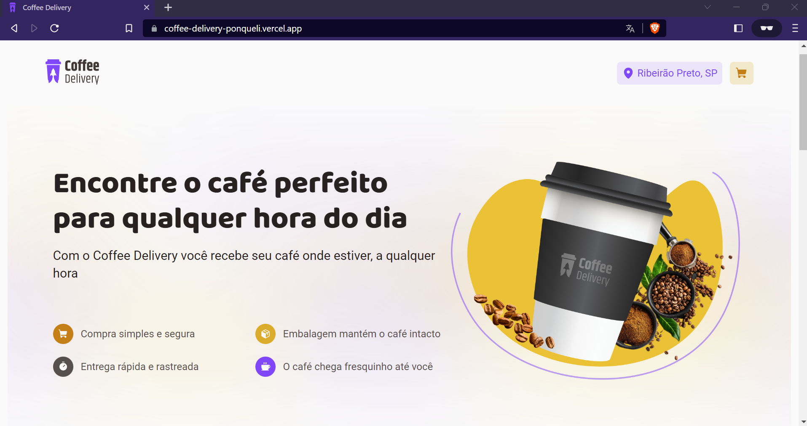
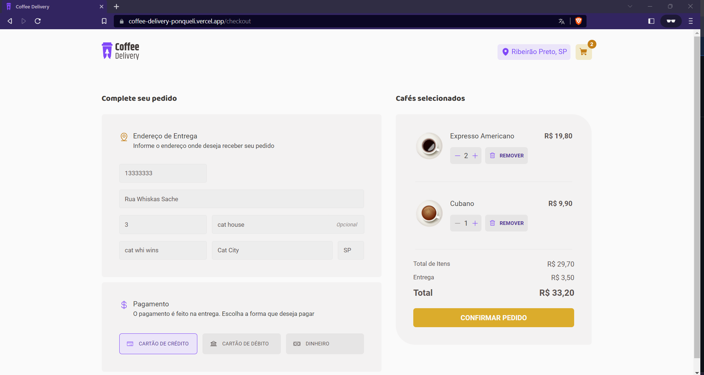
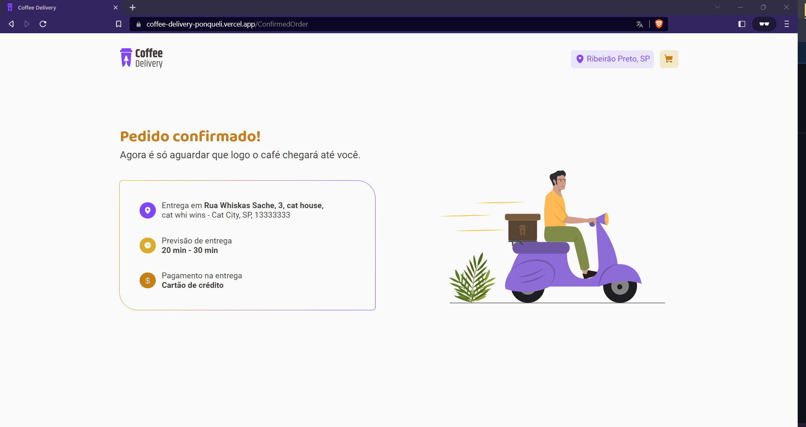

<div id="top" align="center">
  <div>
    
  </div>
  <h4 align="center">☕ Coffee Delivery - A coffee shop app built in React ☕</h4>
</div>

## Resumo

<ol>
  <li><a href="#visão-geral-do-projeto">Visão geral do projeto</a></li>
  <li><a href="#tecnologias-utilizadas">Tecnologias utilizadas</a></li>
  <li><a href="#instalação-e-utilização">Instalação e utilização</a></li>
  <li><a href="#conhecimentos-aplicados">Conhecimentos aplicados</a></li>
</ol>

## Visão geral do projeto

<div align="center">
  
    
    
</div>
<div align="center">
  <h3>
    <a target="_blank" href="https://coffee-delivery-ponqueli.vercel.app/">Ver projeto no Vercel</a>
  </h3>
</div>

</br>

## Tecnologias utilizadas

- [ReactJS](https://reactjs.org/)
- [React Hook Form](https://react-hook-form.com/)
- [React Router Dom](https://www.npmjs.com/package/react-router-dom)
- [Styled Components](https://styled-components.com/)
- [React-Toastify](https://fkhadra.github.io/react-toastify/introduction)
- [ViteJS](https://vitejs.dev/)
- [Phospor React](https://www.npmjs.com/package/phosphor-react)
- [Yup](https://www.npmjs.com/package/yup)
- [Zod](https://www.npmjs.com/package/zod)
- [Vercel](https://vercel.com/)

## Instalação e utilização

### Pré-requisitos

Instalações necessárias

1. NodeJS
2. Npm

### Instalação

1. Baixe as depedências do projeto com o comando `$ npm i`.
2. Rode o projeto com o comando `$ npm run dev`. -> localhost:5173

## Conhecimentos aplicados

### Utilizando Layouts do React Router DOM

Essa funcionalidade permite a criação de layout para nossa aplicação. Por exemplo,
imagine que temos um <Header /> que é exibido em diversas páginas do nosso App,
cada vez que uma página é carregada o <Header /> é carregado novamente. Utilizando
os Layouts evitamos isso. Vamos conferir o código abaixo:

<strong>
O componente Outled diz respeito ao local onde o resto da aplicação vai ser inserido, 
como se fosse o children...
</strong>

```js
// criando layout
import { Outlet } from 'react-router-dom'

import { Header } from '../components/Header'

export function DefaultLayout() {
  return (
    <>
      <Header />
      <Outlet />
    </>
  )
}
```

```js
// configurando as rotas para usar o layout
import { Routes, Route, BrowserRouter } from 'react-router-dom'

import { DefaultLayout } from './layouts/DefaultLayout'
import { Home } from './pages/Home'
import { Checkout } from './pages/Checkout'

export function Router() {
  return (
    <BrowserRouter>
      <Routes>
        <Route path="/" element={<DefaultLayout />}>
          <Route path="/" element={<Home />} />
          <Route path="/checkout" element={<Checkout />} />
        </Route>
      </Routes>
    </BrowserRouter>
  )
}
```

### Reaproveitando estilização de componentes no styled-components

```js
const PriceBase = styled.div<SectionPriceProps>``

export const SectionPrice = styled(PriceBase)``
```

### Tipando elemento através da chave de outro elemento

```js
export const defaultTheme = {
  white: '#FAFAFA',

  'yellow-200': '#F9EBCB',
  'yellow-300': '#F1E9C9',
}

export const Tags = styled.div`
  span {
    background: ${({ theme }) => theme['yellow-300']};
  }
`
```

### Versionando LocalStorage

A prática de versionar o localStorage é usada para evitar bugs futuros na aplicação. 
Imagine que atualmente os dados são salvos de uma forma e, futuramente esse formato 
é alterado. Ao tentar ler os dados que já estavam no localStorage do usuário a aplicação vai bugar.

```js
const localStorageKey = '@ZehCoffeeDelivery:cart'
```

### Utilizando contextos do React

Utilizar contextos no React permite com que posssamos acessar valores de uma forma 
global entre todas as rotas da nossa aplicação.Para isso precisamos criar um provider 
no nível mais alto do nosso app, encapsulando todo o resto.

```js
  <CyclesContextProvider>
    <Rotas />
  </CyclesContextProvider>
```

Agora dentro da rota desejada basta chamar o método useCyclesContext para ter 
acesso a todos os valores enviados pelo provider.

</br>

<h4 align="center"><a href="#top">Voltar ao Início</a></h4>